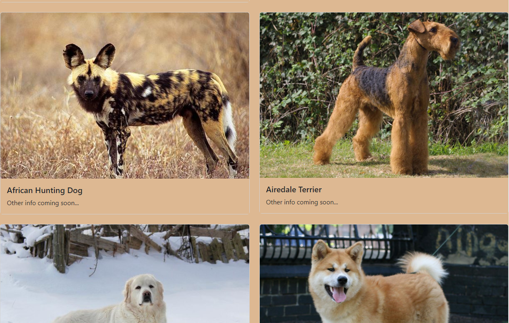

# Dog API Website
Web example using TypeScript to interact with [TheDogAPI](https://thedogapi.com/)

## Getting Started with code
You need the following to run the project locally
- [VS Code](https://code.visualstudio.com/) is our editor of choice
- Install npm with LTS version of [node](https://nodejs.org/en/)
- Install TypeScript with npm `npm install -g typescript`
- Install [Live Server extension](https://marketplace.visualstudio.com/items?itemName=ritwickdey.LiveServer) by Ritwick Dey to view the website

## Live Website
Check out the live website https://joeprogrammer88.github.io/DogAPIWebsite/

## Screenshots
